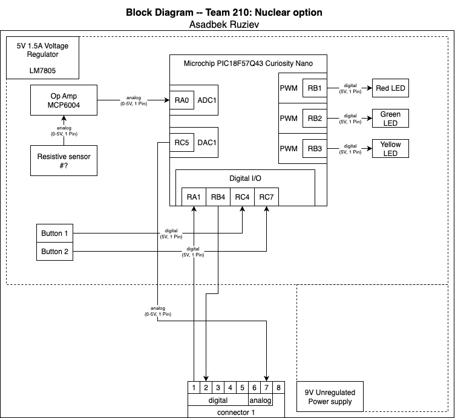

## Overview
Purpose fo block diagram is to ensure that my subsystem is going to be connected properly to subsystem of my teammates and the project will run properly. The sensor I will be working on is resistive sensor for the project and button and LED will be helping me to make required actions from the measurements the sensor will give. Team connections will be given here.

To see more about block diagram of my other teammates, please visit the team website ["here"](https://egr304-2025-f-210.github.io/06-team-block-diagram/) for more details.

## Block Diagram 
Following is my block diagram and is made in draw.io

