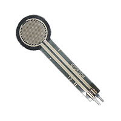
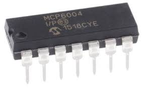

## Examples

> There are only 2 components in my subsystem and in this website I will be sharing about those and rationale why those are choosen over other possible options.

### Components choosen for the subsystem

****

1. 1528-2335-ND Digikey resistive sensor

    

    * $3.95/each
    * [link to product](https://www.digikey.com/en/products/detail/adafruit-industries-llc/166/7393589?gclsrc=aw.ds&gad_source=1&gad_campaignid=20232005509&gbraid=0AAAAADrbLliL8TzXuQg7x9tLNvO4PqNgi&gclid=CjwKCAjw0sfHBhB6EiwAQtv5qagfMTuvM6EWfkF-lDEyOs6MVN03ChBavjL6tKcwhR8kXR566HCPExoCmlEQAvD_BwE)

    | Pros                                      | Cons                                                             |
    | ----------------------------------------- | ---------------------------------------------------------------- |
    | Very Inexpensive                               | Shipping is too costly |
    | Works with all types of nanoboards                      | Needs special PCB layout.                                        |
    | Meets surface mount constraint of project |

    **Other options:** Option 2: OPA333 (TI) op amp
    Option 3: 1738-SEN0293-ND
    Option 4: 1027-1030-ND

    **Rationale for choosing 1528-2335-ND :** This resistive sensor is very cheap and is compatible with any nanoboard and our board too. It provides straightforward measurement of resistanse changes. We need it for filtering amplification of the signal coming through resistive sensor and this componene texactly does that for low-cost price. If ordered today, its shipping is expected in 5 days.

1. MCP6004-I/P-ND op-amp

    

    * $0.40/each or free
    * [Link to product](https://www.microchip.com/en-us/product/mcp6004)

    | Pros                                                              | Cons                |
    | ----------------------------------------------------------------- | ------------------- |
    | Low-power                                             | Varying performance with the temperature change      |
    | quad rail-to-rail I/O CMOS                                 | Limited slew rate |
    | Low power consumption |

**Choice:** Option 2: OPA333 (TI) op amp

**Rationale for choosing MCP6004:** The opamp MCP6004 is given by Microchip and offers low power consumption and has good compatibility with the nano board I am using for the subsystem, which also belongs to Microchip. It is very low cost and there is no need for the level-shifting of the componenets if this componenet is choosen. It's shipping speed is not fast but it is given in our kit so we can easily access it.

## Block: Connectors (sensor input + subsystem headers)

| Solution                                            | Photo                                                  |     Cost | Link                                                                                              | Pros                                                 | Cons                              |
| --------------------------------------------------- | ------------------------------------------------------ | -------: | ------------------------------------------------------------------------------------------------- | ---------------------------------------------------- | --------------------------------- |
| **Option 1:** JST-XH (2.5 mm pitch) wire-to-board   |                          |      Low | [JST XH datasheet](https://www.jst-mfg.com/product/pdf/eng/eXH.pdf)                               | • Locking friction • ~3 A (AWG22) • Widely available | • Not breadboard-friendly         |
| **Option 2:** Molex/JST-XH assortment kit           |                      |  $20–$30 | [Adafruit JST-XH kit (PDF)](https://www.mouser.com/datasheet/2/737/Adafruit_4423_Web-3357984.pdf) | • Handy assortment for lab builds                    | • Bulk purchase; storage overhead |
| **Option 3:** 0.1″ (2.54 mm) pin headers + housings |  | Very low | [Adafruit 0.1″ break-away header](https://www.adafruit.com/product/400)                           | • Breadboard-compatible • Lowest cost                | • No latch; can pull loose        |

**Choice:** **JST-XH**
[JST-XH](../image/jst-xh.png)
on the PCB for field connections; **0.1″ headers** for bench adapters.

**Rationale:** XH gives retention and current capacity on-device; 0.1″ is convenient during prototyping.

---