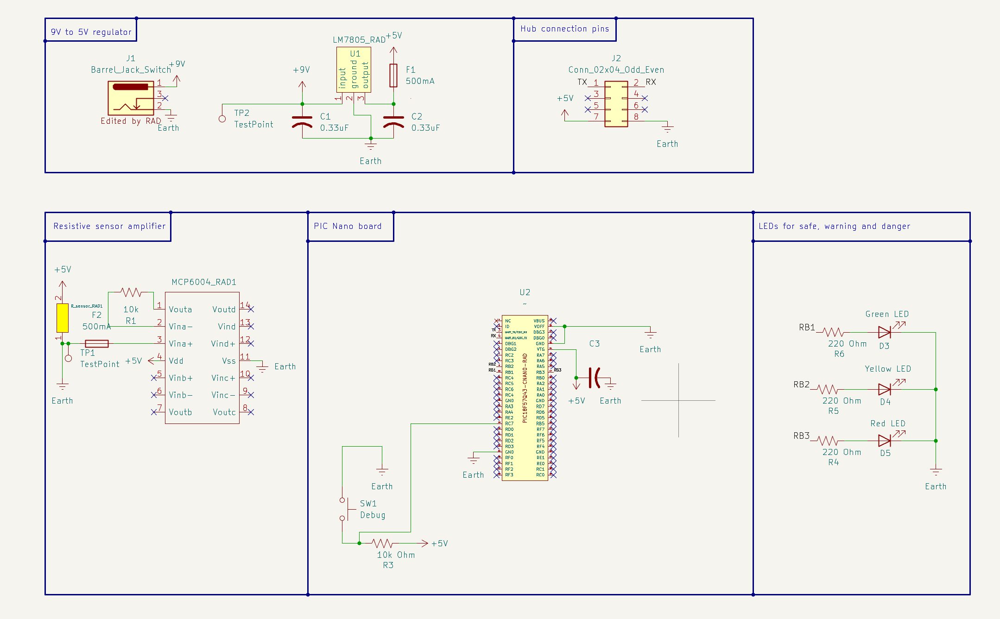

## Overview

This website is design of subsystem of Water conductivity used for the system of Air/Water quality in my team.
 
This subsystem detects changes in resistance through water conductivity and transforms the data into a voltage, amplifies and filters the signal, and then provides the analog voltage to the microcontroller's ADC input. The signal from the zinc probe  is transformed into a digital value by the microcontroller, which then sends that value to Neel's digital subsystem.
 
In my subsystem there is an LED with a current-limiting resistor, a pushbutton for user input, a PIC18F57Q43 Curiosity Nano microcontroller, an MCP6004 operational amplifier for signal amplification, and an LM7805 voltage regulator for power supply as well as resistive sensor.  My initials appear on every custom symbol in the schematic.
 
{style width:"350" height:"300;"}
**Figure 01:** Showing my own schematic.

 
## Resouces

The schematic as a PDF download is available [*here*](Individual_schematic.pdf), and the Zip folder of the project [*here*](Individual_Schematic.zip).