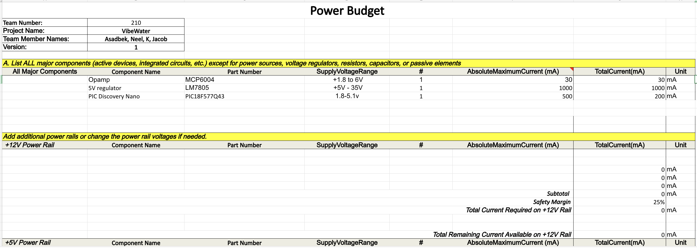
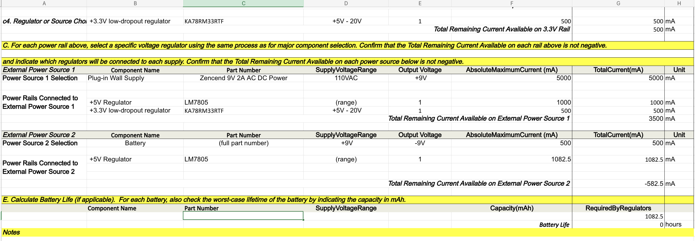

## Overview
Write a overview of what you did and why you did a Power Budget.

> Capture your power budge as a image to display. Take time to get clean breaks and a well organized layout.

{style width:"350" height:"300;"}

{style width:"350" height:"300;"}

{style width:"350" height:"300;"}

## Conclusions

From the prepare Power Budget, .....

## Resouces

The power budget as a PDF download is available [*here*](PowerBudgetExample.pdf), and a Microsoft Excel Sheet [*here*](PowerBudgetExample.xlsx).