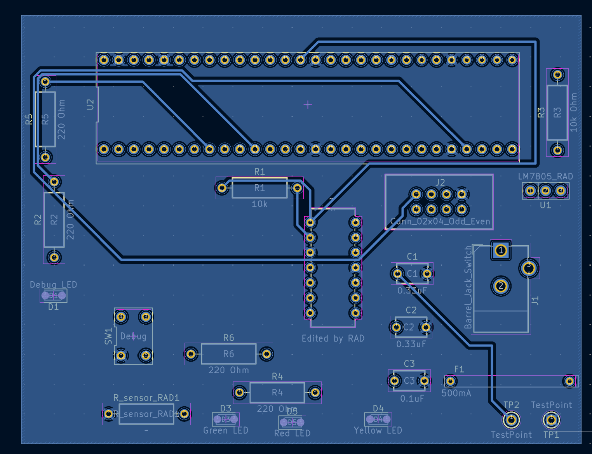

## Overview

This PCB is designed to support a conductivity sensor, PIC Nano MicroChip microcontroller, opamp, voltage regulator.

## PCB 3D View

 

**Figure 1:** Showing Asadbek's Subsystem PCB Front

**Figure 2:** Showing Asadbek's Subsystem PCB Rear

## Resources
The PCBs project zip folder is a downloadable zip file [*here*](Individual subsystem final.zip). The PCBs pdf file containing top and bottom layers can be found [*here*](Individual subsystem layers (1).pdf). Then the PCBs Gerber files can be found [*here*](New gerber.zip).